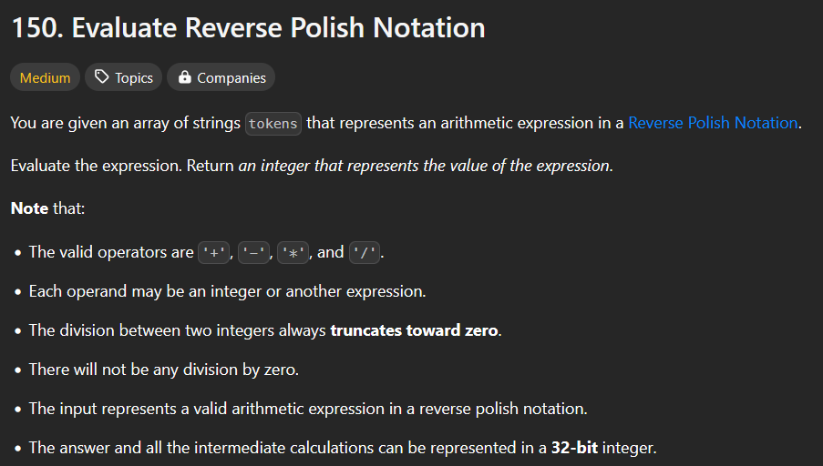

# Evaluate Reverse Polish Notation

level: Medium
Submission Date: May 20, 2025
type: arrays

# Leetcode Problem :



## Logic :

Okay so the logic is to use stack with postfix approach. 

Which is simply pushing till we find an operator 

### Problem

In Java, we don't have the ability to directly create stacks of primitive data types, strings, arrays, or chars. For data structures, we can only create stacks of objects like Integer and Character. 

These are objects in Java, and that's exactly what this code demonstrates.

<aside>
💡

आपने बहुत अच्छा प्रश्न पूछा है। आपके original code में इस लाइन पर एक महत्वपूर्ण error था:

```java
if(!(operators.substring(tokens[i]))) {

```

इस error के कई कारण हैं:

### 1. `substring()` Method का Incorrect Usage

`String.substring()` method दो प्रकार से use होता है:

- `substring(int beginIndex)`: शुरुआती index से string के अंत तक के characters को return करता है
- `substring(int beginIndex, int endIndex)`: शुरुआती index से लेकर end index (end index शामिल नहीं) तक के characters को return करता है

आपके code में आप `substring()` method को इस तरह use कर रहे थे:

```java
operators.substring(tokens[i])

```

यहां समस्या यह है कि `tokens[i]` एक `String` है, जबकि `substring()` method को एक `int` type का argument चाहिए। यानी आप `String` को `int` की जगह पास कर रहे थे, जिससे compilation error आएगा।

### 2. Operator Check का सही तरीका

अगर आप check करना चाहते हैं कि कोई token operator है या नहीं, तो इसके लिए कई बेहतर तरीके हैं:

### Option 1: `contains()` Method का उपयोग

```java
if (!operators.contains(tokens[i])) {
    // यह एक operator नहीं है (number है)
}

```

### Option 2: Individual Checks

```java
if (token.equals("+") || token.equals("-") || token.equals("*") || token.equals("/")) {
    // यह एक operator है
}

```

### Option 3: Set या HashSet का उपयोग

```java
Set<String> operatorSet = new HashSet<>(Arrays.asList("+", "-", "*", "/"));
if (operatorSet.contains(token)) {
    // यह एक operator है
}

```

### 3. Logical Negation (`!`) का Incorrect Usage

आपके original code में एक और समस्या थी - आपने `!` operator को String expression पर apply किया था:

```java
if(!(operators.substring(tokens[i]))) {

```

Java में `!` operator केवल `boolean` expressions पर काम करता है, न कि `String` पर। String को boolean में convert करने का direct syntax नहीं है। आप String को `null` या empty होने के लिए check कर सकते हैं, लेकिन यहां वह भी intention नहीं लगता।

### सही Solution

मेरे द्वारा दिए गए updated solution में, मैंने operator check को एक clear explicit check से replace किया है:

```java
if (token.equals("+") || token.equals("-") || token.equals("*") || token.equals("/")) {
    // Operator logic
} else {
    // Number logic
}

```

यह approach clear, readable और error-free है, और यह exactly वही check करता है जो आप करना चाहते थे - क्या current token एक operator है या नहीं।

</aside>

# Normal Stack Solution

```java
class Solution {
    public int evalRPN(String[] tokens) {
        Stack<Integer> stack = new Stack<>();
        
        for (String token : tokens) {
            // Check if the token is an operator
            if (token.equals("+") || token.equals("-") || token.equals("*") || token.equals("/")) {
                // If token is an operator, pop two values and perform the operation
                int b = stack.pop(); // Second number popped (but first in the operation for - and /)
                int a = stack.pop(); // First number popped
                
                int result = eval(a, b, token);
                stack.push(result);
            } else {
                // If token is a number (as a string), parse it to an integer and push onto stack
                stack.push(Integer.parseInt(token));
            }
        }
        
        // The final result will be the only element left on the stack
        return stack.pop();
    }
    
    private int eval(int a, int b, String opr) {
        switch(opr) {
            case "+":
                return a + b;
            case "-":
                return a - b; // Note: a - b, order matters!
            case "*":
                return a * b;
            case "/":
                return a / b; // Note: a / b, order matters!
            default:
                throw new IllegalArgumentException("Invalid operator: " + opr);
        }
    }
}
```


# Optimized 
ArrayDeque solution - Best

 

```java
public int evalRPN(String[] tokens) {
        // Use ArrayDeque instead of Stack for better performance
        Deque<Integer> stack = new ArrayDeque<>();
        
        for (String token : tokens) {
            // Use a switch statement for operator checks (more efficient than multiple equals)
            switch (token) {
                case "+":
                    stack.push(stack.pop() + stack.pop());
                    break;
                case "*":
                    stack.push(stack.pop() * stack.pop());
                    break;
                case "-":
                    // For subtraction, order matters
                    int b = stack.pop();
                    int a = stack.pop();
                    stack.push(a - b);
                    break;
                case "/":
                    // For division, order matters
                    int divisor = stack.pop();
                    int dividend = stack.pop();
                    stack.push(dividend / divisor);
                    break;
                default:
                    // Must be a number
                    stack.push(Integer.parseInt(token));
                    break;
            }
        }
        
        return stack.pop();
    }
}
```

# Best Soln - Array hi use karlo

```java
class Solution {
    public int evalRPN(String[] tokens) {
        // Use a simple array as a stack with manual index tracking
        int[] stack = new int[tokens.length]; // Max possible stack size is number of tokens
        int top = -1; // Stack pointer
        
        for (String token : tokens) {
            switch (token) {
                case "+":
                    stack[top - 1] = stack[top - 1] + stack[top];
                    top--;
                    break;
                case "*":
                    stack[top - 1] = stack[top - 1] * stack[top];
                    top--;
                    break;
                case "-":
                    // For subtraction, order matters
                    stack[top - 1] = stack[top - 1] - stack[top];
                    top--;
                    break;
                case "/":
                    // For division, order matters
                    stack[top - 1] = stack[top - 1] / stack[top];
                    top--;
                    break;
                default:
                    // Must be a number - push onto stack
                    stack[++top] = Integer.parseInt(token);
                    break;
            }
        }
        
        return stack[0]; // Final result is at the bottom of the stack
    }
}
```